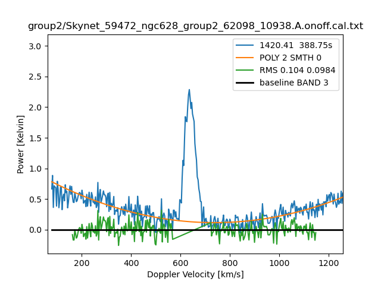

#  Single Dish (GBT/AO) Summer School

My codes and data from the 2021 workshop

There is also 
[my version of gbtgridder](https://github.com/teuben/gbtgridder)
in the python3 branch that you will need to grid the SDFITS file.

Something like

      gbtgridder/src/gbtgridder --clobber Skynet_59471_messier_31_62079_10919.cyb.fits
	  
should do the job.  This should be version 0.6pjt or later, and make
sure you see the new --dish option!

Although this will produce a cube, line and cont map, the
determination of the continuum isn't always good and you may need to
an additional baseline subtraction from either the cube or line.

## Files in this repository

* archive/ - some sample archive data from M31
* cont_sub.py - manual continuum subtraction (from group1)
* convert_lsrk.py -  convert a topocentric cube to VLSR (from group1)
* GBO20m_SSDS_group2_Data.*  - spreadsheet with our data and derived quantaties
* group2/   - our data (M31, N628, N1530, N3976, N4565, N4559)
* mom0.py - make a good moment-0 map (from group1)
* plotsp1.py - analysis of noise with baseline subtraction, option to smooth and XX+YY average
* presentation.pdf - our 10 minute final presentation
* something.ipynb - python notebook with the (scaled?) averaging technique, options to smooth and bin

## Example how to review a dataset using plotsp1.py

Note this script is currrently hardcoded for HI (1420MHz) but can deal with any of the 4 bands (XX1, YY1, XX2, YY2)
or combine them (band=5 means XX1+YY1 and band=6 means XX2+YY2).

First you pick the band (1,2,3,4,5,6) and visualize the spectrum:

    ./plotsp1.py group2/Skynet_59472_ngc628_group2_62098_10938.A.onoff.cal.txt 3
	BAND:  3
    SMOOTH:  0
    POLY:  -1
    DATE_OBS:   ['2021-09-15T04:30:58.120']
    OBSERVER:   ['sdss2_39397']
    TSYS:       ['XX1:102.31, YY1:113.57', 'XX2:139.74, YY2:156.84']
	  
after you will need to judge in which segment(s) what order polynomial will apply. In this example we took the 
overkill aproach of fitting the whole band with a very high 8th order polynomial:

    ./plotsp1.py group2/Skynet_59472_ngc628_group2_62098_10938.A.onoff.cal.txt 3 0 8 1600 3000  100 500 800 1500
	
but most people would not want to this broad and high order. Surprisingly the
repored noises with and without trend is very close (0.106 and 0.101K), suggesting
not many systematic effects are left.

A more reasonable approach would be

    ./plotsp1.py group2/Skynet_59472_ngc628_group2_62098_10938.A.onoff.cal.txt 3 0 2 160 570 720 1150

which is probably how most people would want to fit a baseline.  The reported internal noise is now 0.0984 K
Given the crazy polynomial outside the baseline segments, you will need to zoom in via matplotlib and 
convince yourself this is a pretty good detection.

